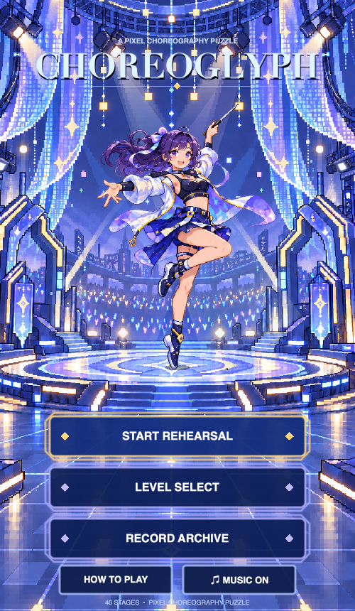
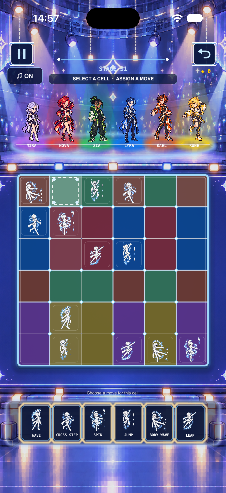

# Choreoglyph

Choreoglyph 是一款基于 Swift、SpriteKit 和 GameplayKit 的像素风舞蹈编排解谜游戏。

本仓库是项目作品集，不包含正式产品源码、完整关卡数据或原始美术资源。

## 画面展示

| 主界面（原生 SpriteKit 场景） | 玩法界面（iPhone 模拟器） |
| --- | --- |
|  |  |

截图来自项目测试过程，仅展示界面效果，不包含原始素材文件或完整关卡数据。

## 演示视频

[下载/播放首页动态演示视频](videos/choreoglyph-home-demo.mp4)

视频来自 iPhone 模拟器，仅展示主页动态、角色动作和舞台效果；完整录屏说明见 [videos/README.md](videos/README.md)。

## 项目亮点

- 使用规则引擎承载棋盘、冲突、候选、撤销和通关逻辑；
- 使用 SpriteKit 负责像素风场景、帧动画和交互表现；
- 使用 GameplayKit 状态机管理游戏中的进行、暂停、动画和结算流程；
- 使用 Json 配置驱动内容，将角色、动作、关卡与资源引用从场景代码中分离；
- 使用确定性随机种子生成关卡，并通过求解器验证关卡约束和唯一解；
- 通过命令行测试和界面冒烟测试验证核心流程。

## 我的工作

- 产品概念、玩法规则和交互流程设计；
- 工程搭建与跨 macOS/iOS 适配；
- 规则层与表现层拆分；
- 程序化关卡生成、存档和进度系统设计；
- 主界面帧动画、像素资源加载和交互状态设计；
- 测试方案、问题定位和工程文档整理。

## 文档

- [问题与解决思路](docs/问题与解决思路.md)：实际问题、工程难点、处理/解决方案与当前状态。
- [测试与说明](docs/测试与说明.md)：测试对象、方法、结果、发现的问题与发布边界。

## 公开范围说明

本仓库只展示项目背景、技术思路、Demo 截图和质量实践。正式产品的源代码、完整关卡配置、内部构建日志、原始素材文件和未发布功能不在公开范围内。

## 素材说明

作品展示所使用的截图和视觉素材仅使用项目原创、用户提供并授权，或项目专用生成素材；如后续添加外部素材，将单独记录来源与授权条件。
