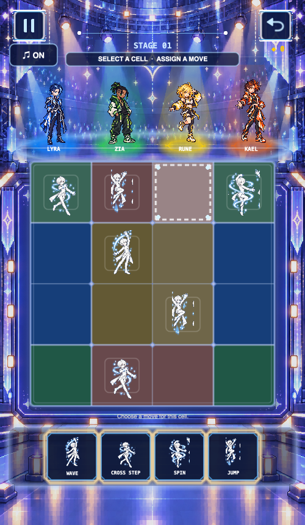
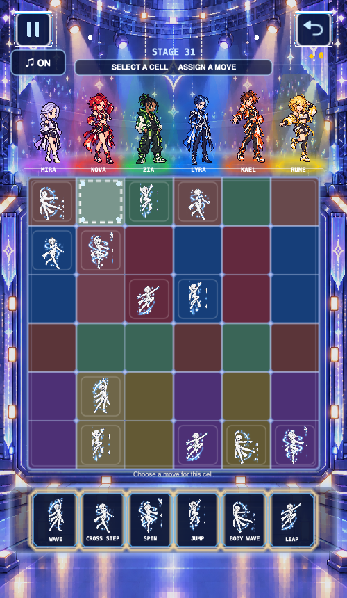

# Choreoglyph：测试与说明

以下整理 2026-09-23 至 09-24 的 Demo 测试。逐项说明测试、发现问题、解决和再测试的证据。测试使用隔离构建与独立进度数据，没有清空或修改用户真实存档。Swift 片段均为项目代码或测试的局部摘录，省略了无关上下文，不包含完整关卡配置与答案。

## 第三轮：测试—发现问题—修复—复测

第三轮重点回查上一轮确实复现或确认的缺陷。下列“再测试”严格区分自动化运行通过与代码路径复查，不把后者写作真机交互通过。

### 1. 旧进度实例覆盖最新存档

**测试：** 用同一个内存仓库创建两个 `GameProgressStore`。实例 A 完成关卡后，实例 B 保持较旧的内存状态，再执行一次记录打开操作。对比仓库里的完成集合和奖励余额。

**发现问题：** 修复前，B 会把 A 刚保存的完成记录和碎片余额覆盖回旧值；修改前的回归用例确实失败。这是两个 Store 交错操作下的丢失更新，不等同于已经在 iPad 双窗口上实测。

**解决：** 每次写入前先从仓库读取最新进度，再在该值上执行变更；无法读取存档时不静默把异常或未来版本的数据覆盖为全新存档。关键代码摘录：

```swift
private func update(_ mutation: (inout GameProgress) -> Bool) -> Bool {
    guard let stored = repository.load() else { return false }
    var latest = Self.normalized(stored, totalLevels: totalLevels)
    let changed = mutation(&latest)
    progress = latest
    if changed { repository.save(latest) }
    return changed
}
```

**再测试：** 两实例交错写入的回归用例通过，旧实例不能再覆盖已完成关卡及碎片余额。这个证据覆盖同进程、顺序交错的存储操作；独立并发事务和真实设备多窗口仍需另外验证。

### 2. 普通按钮快速点击后漂移

**测试：** 对普通交互按钮连续快速执行按下与释放，观察按钮的静止位置。此前重复十次后可见 Y 方向位置偏移。

**发现问题：** 按下动作未结束就被移除，释放动作却仍用相对位移；下一次点击又从偏离的位置开始，误差被反复累积。这与主页仅使用缩放反馈的主按钮不是同一条动画路径。

**解决：** 记录静止基准坐标，释放时用绝对位置作为两段动画的终点，不再按当前位置累加释放位移。关键代码摘录：

```swift
let origin = restingPosition ?? position
let settle = SKAction.sequence([
    .group([.scale(to: 1.02, duration: 0.07),
            .move(to: CGPoint(x: origin.x, y: origin.y + 0.5), duration: 0.07)]),
    .group([.scale(to: 1, duration: 0.09),
            .move(to: origin, duration: 0.09)])
])
run(settle, withKey: "button-release")
```

**再测试：** 第三轮完成代码回归复查，确认释放路径以基准位置归位、不再连续累加相对位移。该轮报告没有记录修复后再次运行十次点击的原生动画测量，因此这里不把它表述为完整动态复测通过。

### 3. 已完成单元改错后不重新触发反馈

**测试：** 先填对一行，再覆盖其中一个可编辑格为错误值，检查完成标记；随后改回正确值，检查是否再次产生完成事件；再切换为候选模式。

**发现问题：** 修复前，改错后已完成标记仍保留；改回正确值时，由于集合里还保留旧记录，新的完成事件不再发出。列和区域也有相同的状态管理路径。

**解决：** 每次填写或改候选后，重算受影响的行、列和区域；不再正确的单元从完成集合中移除。之后只有从未完成变成完成，才重新产生事件。关键代码摘录：

```swift
private func invalidateCompletedUnits(changedIndex: Int) {
    let row = changedIndex / level.size
    let column = changedIndex % level.size
    let region = level.regions[changedIndex]
    if !unitIsCorrect("row", row) { completedRows.remove(row) }
    if !unitIsCorrect("column", column) { completedColumns.remove(column) }
    if !unitIsCorrect("region", region) { completedRegions.remove(region) }
}
```

**再测试：** 第三轮回归覆盖行完成、覆盖改错、修正后重新发事件、改为候选后失效，均通过。测试中关键断言是：

```swift
precondition(!engine.snapshot().completedRows.contains(row))
let repair = try engine.apply(index: edit, value: level.solution[edit], asNote: false)
precondition(repair.events.contains(.rowCompleted(row)))
```

片段只展示断言方式；测试数据和答案仍留在私有项目中。

### 4. macOS 菜单绕过关内退出确认

**测试：** 检查游戏进行时使用系统菜单返回主页、进入选关或重新开始的调用路径，并对照关内暂停确认流程。

**发现问题：** 旧菜单处理直接切换场景，没有经过关内确认；未持久化的当局填写会随场景销毁而丢失。这是代码路径确认的问题，并非在本轮设备上重新录制的交互复现。

**解决：** 系统菜单不再直接切换活动对局，先把导航请求交给当前游戏场景；场景处于游玩或动画状态时进入暂停确认，再按用户选择跳转。非游戏场景仍直接导航。菜单入口摘录：

```swift
@objc private func menuHome() {
    if let game = gameView?.scene as? GameScene {
        game.requestMenuNavigation(.home)
    } else {
        presentHome()
    }
}
```

**再测试：** 第三轮完成调用路径复查，确认三个菜单入口均经过游戏场景的导航请求，不再直接丢弃活动对局。macOS 完整菜单点击回归仍需另行执行。

### 第三轮自动化与构建结果

- 规则引擎冒烟测试通过；
- 新增的回归测试覆盖完成单元失效、并发进度写入、坏棋盘和坏动作配置校验；
- macOS 构建通过；
- iOS Simulator 目标无签名构建通过；
- 本轮使用隔离内存仓库和隔离构建目录，没有读取、清空或修改真实存档。

### 棋盘视觉快照

以下是第三轮测试时由项目已有代码与授权素材渲染的棋盘状态截图，用于展示两种尺寸下的配色和布局，不是上述四项缺陷修复的证明，也不包含完整关卡答案。

4×4 棋盘快照：



6×6 棋盘快照：



### 第三轮仍未完成的验证

本轮 iOS 模拟器服务无法连接，因此没有把真实模拟器触控或窗口生命周期写成“已通过”。iPhone/iPad 真机安装、后台恢复、iPad 双窗口和长时间帧率/内存测试仍需在可用设备上执行。

## 1. 平台构建

**测试对象：** macOS App、iOS Simulator 以及 iOS Release 编译目标。

**方法：** 分别执行 Debug 构建，并对 iOS Release 目标进行无签名编译检查，确认 Swift 源文件、资源复制和目标配置能完成构建。

**结果：** macOS Debug、iOS Simulator Debug 和 iOS Release 无签名编译通过。

**边界：** 无签名编译不等于真机安装，也不等于 App Store 上架审核通过。iPad 方向策略仍有发布配置警告，需要在正式发布前明确设备支持范围并验证。

## 2. 规则引擎的输入与撤销

**测试对象：** 固定格、普通填入、同一行/列/区域的冲突、候选标记、撤销、重置和完成事件。

**方法：** 不启动 SpriteKit 图形界面，直接构造规则引擎并检查每一步的棋盘值、候选集合和事件。这样可以把玩法规则错误与界面渲染错误分开定位。

**结果：** 既有冒烟测试覆盖了上述基础路径；填写完整答案时可收到全盘完成事件。

测试代码摘录：先制造同一组约束内的冲突，再检查撤销能恢复棋盘。

```swift
_ = try engine.apply(index: first, value: 1, asNote: false)
let conflict = try engine.apply(index: second, value: 1, asNote: false)
expect(conflict.conflicts.contains(first), "Peer conflict was not detected")
try engine.undo()
try engine.undo()
expect(engine.values[first] == 0 && engine.values[second] == 0,
       "Undo did not restore values")
```

**发现与边界：** 上一轮补充测试曾发现局部完成状态失效；第三轮已修复并通过行覆盖、修正、候选和事件回归。仍需保留这类状态转换测试，不能只依赖“填入正确答案即可通关”的基础用例。

## 3. 程序化关卡与唯一解

**测试对象：** 当前 40 个关卡，包括不同棋盘尺寸的关卡组合。

**方法：** 使用独立求解器检查每一关的行、列、区域约束、区域格数、初始提示与唯一解；比较完整答案是否重复；逐关填入答案，检查全盘完成事件的触发次数。

**结果：** 本轮检查中，40 关均满足相关约束并具有唯一解，完整答案互不重复；逐关填入正确答案时，每关恰好产生一次全盘完成事件。

**边界：** 该结论只适用于被测版本和这批生成内容。生成配置或规则变化后需要重新执行验证。

## 4. 存档、奖励与兑换

**测试对象：** 关卡解锁、完成后的奖励发放、重复完成的幂等行为、兑换扣款、存档编码和旧版本数据迁移。

**方法：** 在隔离的进度仓库中执行完成与兑换操作，检查余额和已解锁内容，再做序列化往返及迁移验证。

**结果：** 单实例的常规流程通过现有冒烟测试。

测试代码摘录：同一关重复完成不能继续解锁下一关，存档编码后也必须保持一致。

```swift
expect(progress.complete(level: 1, totalLevels: totalLevels),
       "Level 1 should complete once")
expect(!progress.complete(level: 1, totalLevels: totalLevels),
       "Completing the same level twice must be idempotent")
let data = try JSONEncoder().encode(progress)
let restored = try JSONDecoder().decode(GameProgress.self, from: data)
expect(restored == progress, "Codable progress must round-trip")
```

**发现与边界：** 上一轮并发场景曾复现旧 Store 覆盖新状态；第三轮已通过“写入前读取最新值”的回归测试。真实 iPad 双窗口仍需设备级验证，领域层回归通过不等于设备生命周期验证完成。

## 5. 原生界面与动画反馈

**测试对象：** 主页动态舞台效果、按钮大小和缩放反馈、规则弹窗翻页与点击阻挡，以及碎片不足提示的文案和余额。

**方法：** 在原生 SpriteKit 测试窗口中观察动画和交互状态，结合重复输入检查按钮按下/释放行为。测试后又按产品要求检查了主页人物动作关闭的版本。

**结果：** 舞台灯束、环形光点、上升粒子运动和主页主按钮反馈通过检查；规则弹窗的翻页、边界与输入阻挡符合预期；碎片不足时余额保持不变。当前版本主页人物不再自动眨眼或换姿势，舞台背景动态效果仍在运行。

**发现与边界：** 上一轮曾复现普通按钮的位移累积；第三轮完成绝对坐标归位并通过代码回归复查。测试窗口验证仍不代表所有设备上的每个页面都已经逐一人工检查。

## 6. 风险分级与后续验证

综合前三轮检查，区分自动化回归、代码路径复查和尚未进行的设备验证：

- **自动化回归通过：** 旧进度实例覆盖、完成单元改错后的状态与事件。
- **代码路径复查通过：** 普通按钮绝对坐标归位、macOS 菜单进入关内确认流程。
- **尚未完成：** iPhone/iPad 真机触控、后台恢复、双窗口交互、音频中断、长时间帧率/内存/温度测试及正式上架流程。

## 结论

当前证据支持“核心规则与主要流程具备可运行性；第三轮对四项已确认问题完成代码修改，其中两项有自动化回归通过、两项有代码路径复查”。这不等于完整动态交互、真机兼容性、性能或 App Store 发布验证。本页与[问题与解决思路](问题与解决思路.md)对应，记录测试证据而非发布承诺。
