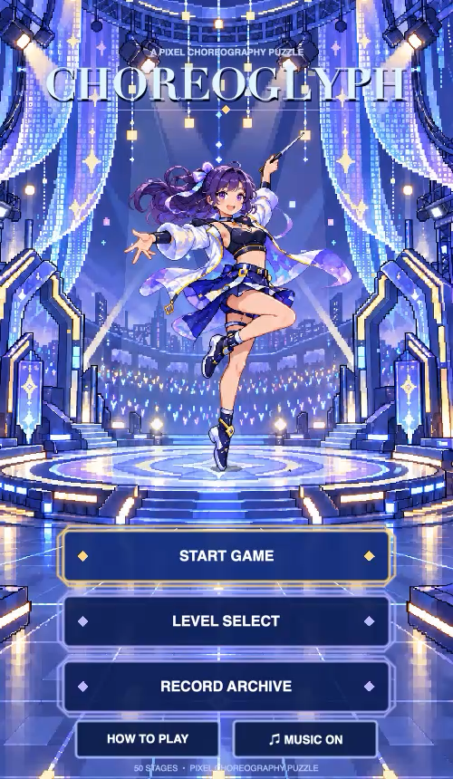
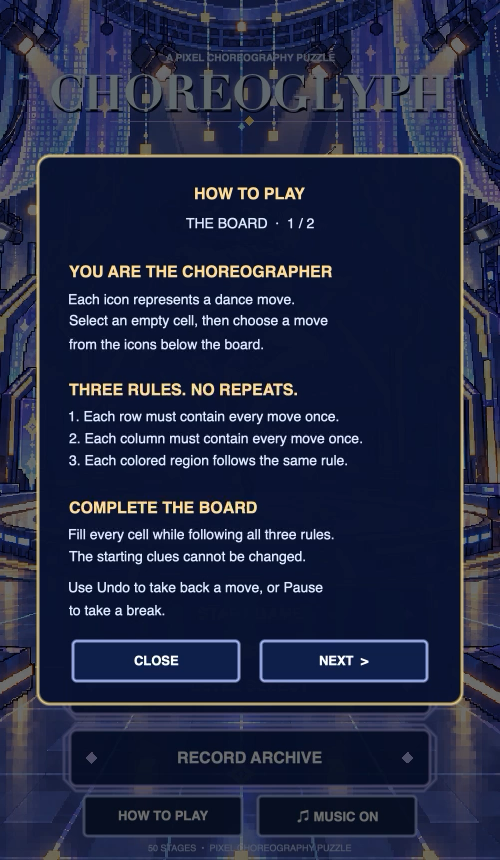
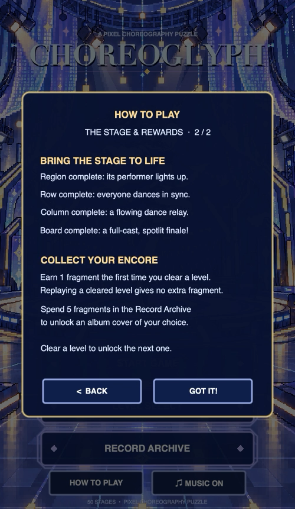
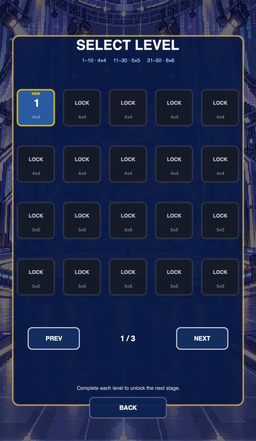
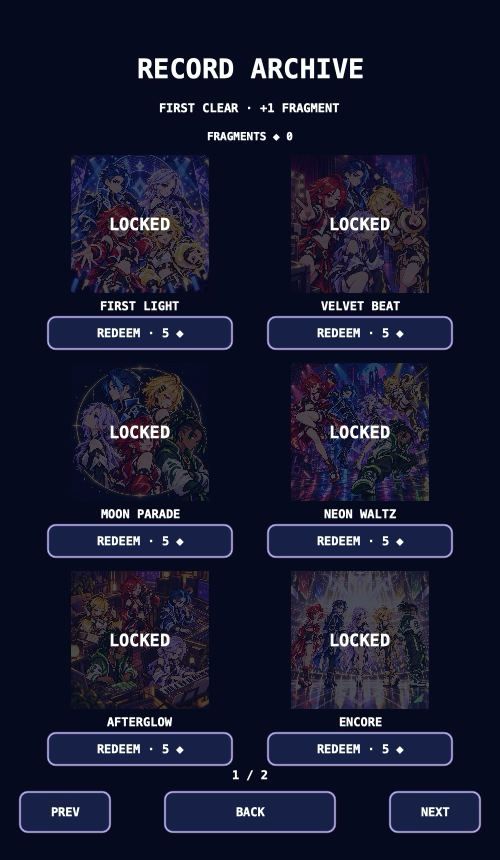
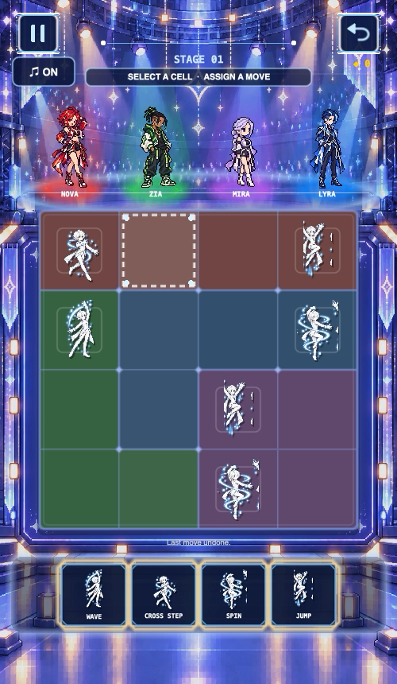
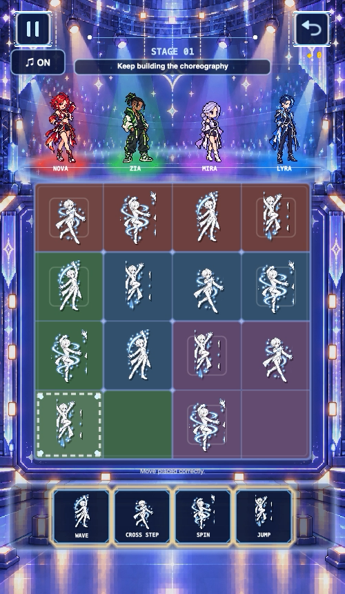
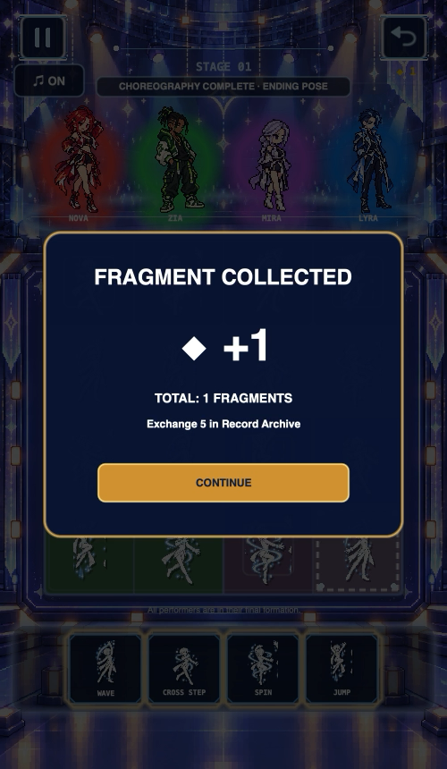
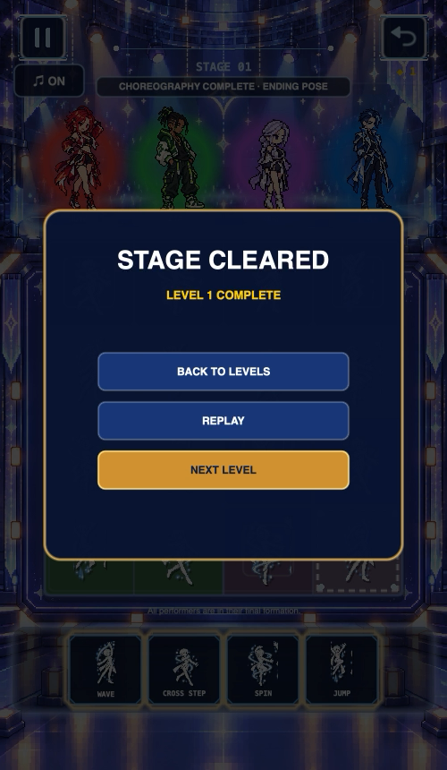

# Choreoglyph 演示流程

以下截图来自当前 50 关版本的实际运行窗口，用于展示从主页进入各功能页面，再完成第 1 关的路径。仓库中的早期测试文档记录的是当时的 40 关版本。截图只保留游戏画面，不包含桌面、终端、Xcode 或用户存档信息。

## 1. 主页与玩法说明

主页包含开始游戏、选关、记录、玩法说明和音乐开关。舞台灯光、角色待机动作和粒子效果持续运行。

点击“HOW TO PLAY”后，第一页说明棋盘规则：选择空格，再从动作栏分配动作；行、列和彩色区域都不能重复。

第二页说明区域完成、整行完成、整列完成和通关奖励的反馈方式。

## 2. 主页入口页面

“LEVEL SELECT”展示关卡解锁状态、棋盘尺寸和分页导航。

“RECORD ARCHIVE”展示通关后获得的收藏内容和兑换入口。

## 3. 进入一关并编排动作

进入第 1 关后，顶部显示当前舞台和状态提示，中间棋盘按区域着色，底部动作栏提供可分配的舞蹈动作。

点击空格后，当前格以虚线框标记，玩家可以选择动作完成编排。

随着动作逐格填入，棋盘、舞者灯光和状态提示同步变化；行、列或区域完成时会触发对应的舞台反馈。

## 4. 通关、奖励和解锁

棋盘完成后先展示奖励弹窗，首次通关获得一个碎片。

点击继续后进入结果页，可以返回选关、重玩当前关或进入下一关。

首次通关后下一关会解锁；结果页也提供“下一关”入口。

## 5. 作品集公开范围

这些图片用于展示界面层级、交互反馈和完整流程。公开仓库没有放入正式项目源码、完整关卡答案、内部构建日志或用户存档；截图中的棋盘只作为演示画面，不承担发布版本配置的作用。
